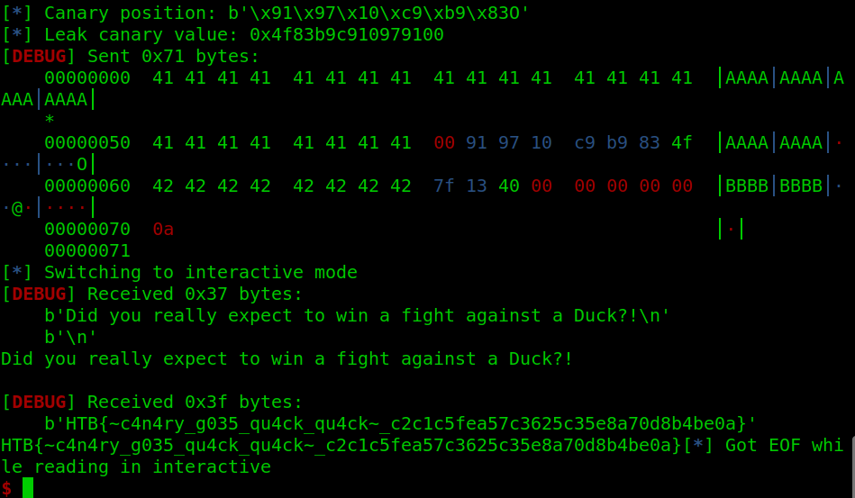

# LITCTF Quals 2024


MISC, WEB


## welcome (Misc - Very Easy)

### 1. Description

> Please join the Discord for the latest announcements and read the [contest rules](https://lit.lhsmathcs.org/logistics)! Good luck!

### 2. Solve Walkthrough

* Flag 1 in the announcement channel: `LITCTF{we_4re_happy_1it20`.

<figure><figcaption></figcaption></figure>

* Flag 2 at the bottom of [contest rules](https://lit.lhsmathcs.org/logistics) page: `24_is_h4pp3n1ng_and_h0p3_u_r_2}`.

<figure><figcaption></figcaption></figure>

* **GOTCHAA!!**

### 3. Flag

<kbd>LITCTF{we\_4re\_happy\_1it2024\_is\_h4pp3n1ng\_and\_h0p3\_u\_r\_2}</kbd>

## anti-inspect (Web - Very Easy)

### 1. Description

> can you find the answer? **WARNING: do not open the link your computer will not enjoy it much**. URL: [_http://litctf.org:31779/_](http://litctf.org:31779/)
>
> Hint: If your flag does not work, think about how to style the output of console.log

### 2. Solve Walkthrough

* As you can see at the description, if we open the link,your browser will crashed.
* So, I try another way to open the page, yap.. by using **cURL**.
* Simply, cURL is web browser, but in your terminal. We can perform HTTP request to the target server of course with command-line :).
* Here's the output while i'm trying to request with cURL.

```bash
curl http://litctf.org:31779/
```

<figure><figcaption></figcaption></figure>

* After I see the response, makes sense that we are told not to open the link through a web browser, it does **infinite loop** (look at the _while true_ statement).
* Alright, just ignore it. In the response show me the flag, but, if you read the challenge description carefully, you will notice that the flag is gone wrong !
* So, to fix that, I try to save the response into a HTML file and open it in my web browser to see the correct formatted flag.
* And yeah, we got the flag (just copy the output from your console).
* **GOTCHAA!!.**

<figure><figcaption></figcaption></figure>

### 3. Flag

<kbd>LITCTF{your\_fOund\_teh\_fI@g\_94932}</kbd>

## jwt-1 (Web - Very Easy)

### 1. Description

> I just made a website. Since cookies seem to be a thing of the old days, I updated my authentication! With these modern web technologies, I will never have to deal with sessions again. Come try it out at http://litctf.org:31781/.

### 2. Solve Walkthrough

* As you can know from the challenge title, it shoule be correlation with JWT token, so prepare for https://jwt.io website.
* The website have 3 features/endpoints, that is:
  * Sign up -> **/signup/**
  * Log in -> **/login/**
  * Get the flag -> **/flag**
* Of course we don't know admin password, but after you login (or signup if you don't have an account before), you can see new generated JWT token in the **Storage > Cookies** of your developer tools.
* Copy that JWT token to the jwt.io website, and you will see the payload data contain `name` and `admin`.
* I change the `admin` value to **true**, and then I replace the original JWT token cookies to crafted JWT token payload.

<figure><figcaption></figcaption></figure>

* When I try to visit the **/flag** endpoint, it show me the flag.
* **GOTCHAA!!**

<figure><figcaption></figcaption></figure>

### 3. Flag

<kbd>LITCTF{o0ps\_forg0r\_To\_v3rify\_1re4DV9}</kbd>

## jwt-2 (Web - Easy)

### 1. Description

> its like jwt-1 but this one is harder URL: [_http://litctf.org:31777/_](http://litctf.org:31777/)

### 2. Solve Walkthrough

* Given a TypeScript source file like below:


```typescript
import express from "express";
import cookieParser from "cookie-parser";
import path from "path";
import fs from "fs";
import crypto from "crypto";

const accounts: [string, string][] = [];

const jwtSecret = "xook";
const jwtHeader = Buffer.from(
  JSON.stringify({ alg: "HS256", typ: "JWT" }),
  "utf-8"
)
  .toString("base64")
  .replace(/=/g, "");

const sign = (payload: object) => {
  const jwtPayload = Buffer.from(JSON.stringify(payload), "utf-8")
    .toString("base64")
    .replace(/=/g, "");
    const signature = crypto.createHmac('sha256', jwtSecret).update(jwtHeader + '.' + jwtPayload).digest('base64').replace(/=/g, '');
  return jwtHeader + "." + jwtPayload + "." + signature;

}

const app = express();

const port = process.env.PORT || 3000;

app.listen(port, () =>
  console.log("server up on http://localhost:" + port.toString())
);

app.use(cookieParser());
app.use(express.urlencoded({ extended: true }));

app.use(express.static(path.join(__dirname, "site")));

app.get("/flag", (req, res) => {
  if (!req.cookies.token) {
    console.log('no auth')
    return res.status(403).send("Unauthorized");
  }

  try {
    const token = req.cookies.token;
    // split up token
    const [header, payload, signature] = token.split(".");
    if (!header || !payload || !signature) {
      return res.status(403).send("Unauthorized");
    }
    Buffer.from(header, "base64").toString();
    // decode payload
    const decodedPayload = Buffer.from(payload, "base64").toString();
    // parse payload
    const parsedPayload = JSON.parse(decodedPayload);
                // verify signature
                const expectedSignature = crypto.createHmac('sha256', jwtSecret).update(header + '.' + payload).digest('base64').replace(/=/g, '');
                if (signature !== expectedSignature) {
                        return res.status(403).send('Unauthorized ;)');
                }
    // check if user is admin
    if (parsedPayload.admin || !("name" in parsedPayload)) {
      return res.send(
        fs.readFileSync(path.join(__dirname, "flag.txt"), "utf-8")
      );
    } else {
      return res.status(403).send("Unauthorized");
    }
  } catch {
    return res.status(403).send("Unauthorized");
  }
});

app.post("/login", (req, res) => {
  try {
    const { username, password } = req.body;
    if (!username || !password) {
      return res.status(400).send("Bad Request");
    }
    if (
      accounts.find(
        (account) => account[0] === username && account[1] === password
      )
    ) {
      const token = sign({ name: username, admin: false });
      res.cookie("token", token);
      return res.redirect("/");
    } else {
      return res.status(403).send("Account not found");
    }
  } catch {
    return res.status(400).send("Bad Request");
  }
});


app.post('/signup', (req, res) => {
  try {
    const { username, password } = req.body;
    if (!username || !password) {
      return res.status(400).send('Bad Request');
    }
    if (accounts.find(account => account[0] === username)) {
      return res.status(400).send('Bad Request');
    }
    accounts.push([username, password]);
    const token = sign({ name: username, admin: false });
    res.cookie('token', token);
    return res.redirect('/');
  } catch {
    return res.status(400).send('Bad Request');
  }
});
```


* From the source code above, we can see that the secret key is weak (not properly random): `xook`.
* But, if we do the samething like `jwt-1` like previous, we got a response **Unauthorized ;)**.
* Then, I craft this JWT payload (with user **"name": "joni"** and **"admin": true**).

<figure><figcaption></figcaption></figure>

* Finally, I replace the original JWT token cookies to crafted JWT token payload with `xook` as secret key.
* And if I visit the **/flag** endpoint, we can see the flag.
* **GOTCHAA!!**

<figure><figcaption></figcaption></figure>

### 3. Flag

<kbd>LITCTF{v3rifyed\_thI3\_Tlme\_1re4DV9}</kbd>

***

**Tags**: #ctf, #misc, #web-exploitation

