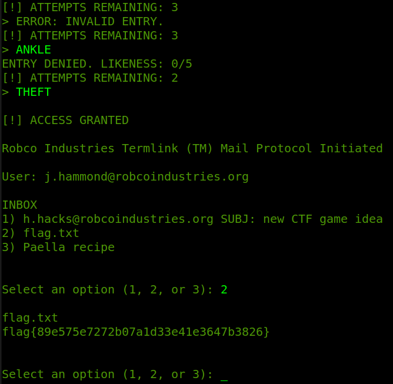

# Science 100


Category: Warmup - Misc

Difficulty: very easy


## Description

> **Author**: @HuskyHacks
>
> Patrolling the Mojave almost makes you wish for a nuclear winter.

## Solve Walkthrough

* Basically, we've to input all "English" words in the screen to get access granted.
* If we got the correct one, then we can continue and choose the option number **2**, which is to print the `flag.txt` file.
* Here's the flag:

<figure><figcaption></figcaption></figure>

## Flag

<kbd>flag{89e575e7272b07a1d33e41e3647b3826}</kbd>
