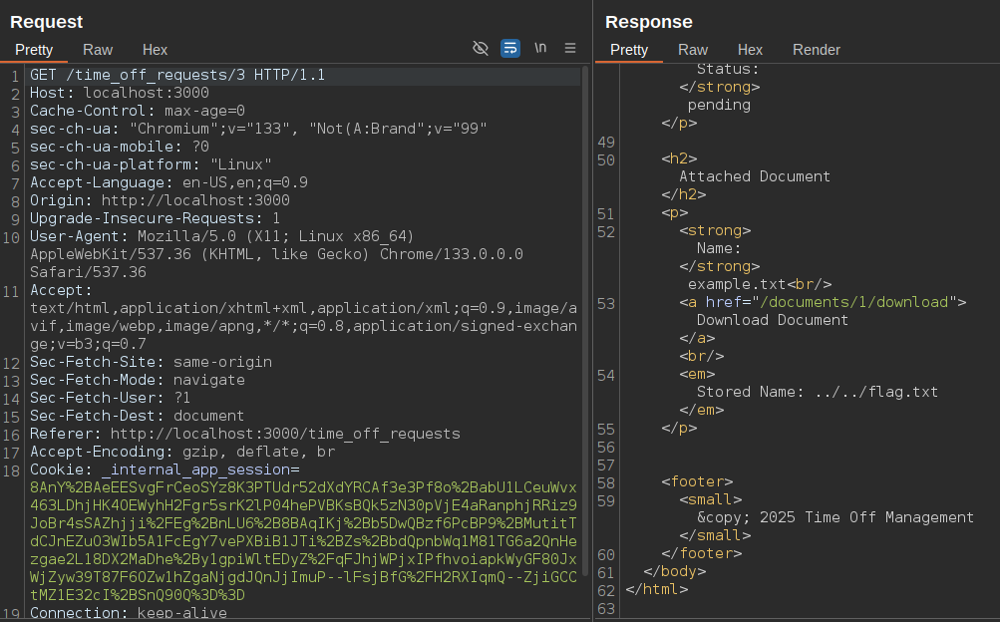
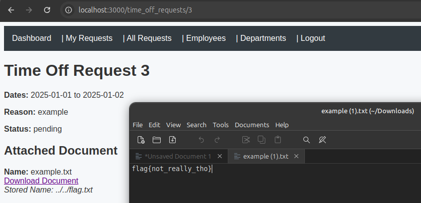
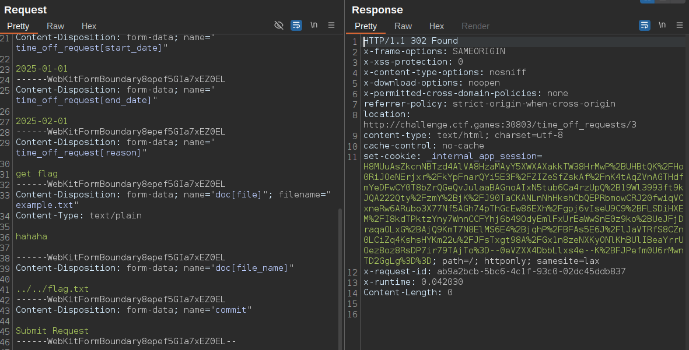
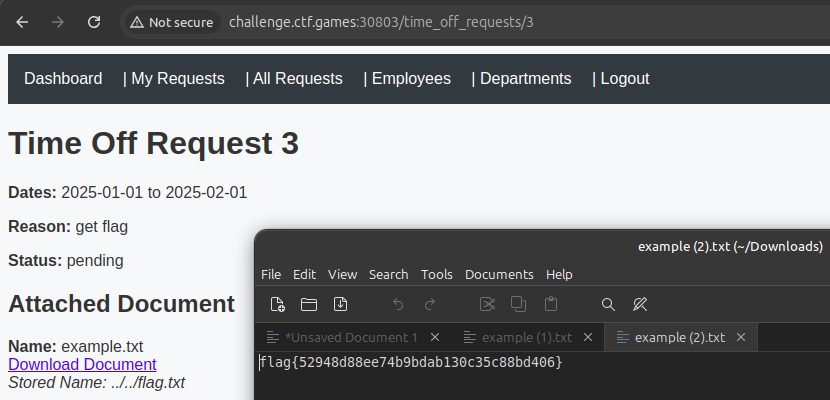

# TimeOff


Category: Web

Difficulty: easy


## Description

> **Author**: @HuskyHacks\
>
>
> TimeOff is an early build for our upcoming line of business application that will help us manage our employee's PTO requests. Please give it a thorough security test and let us know if you find anything. To set you up for success, our devs have given you the full source code and a development build of the current app. Feel free to build a local instance for your security test. If you find anything exploitable, prove it by capturing the flag.txt file on the live instance!\
>
>
> The challenge source code is available in the challenge.zip folder. The password is `snyk-ftf-2025`.\
> \
> Use the Dockerfile to run a local instance of the challenge! To build and the container, unzip the contents of the challenge.zip file and run: `docker build -t [challenge_name] . && docker run -it -p 3000:3000 [challenge_name]`\
>
>
> **Credentials**:
>
> * admin@example.com:admin123
> * user@example.com:user123

## Solve Walkthrough

* This is an easy web challenge and I solve it after the challenge ended.
* Execute below command to run the challenge locally.


```bash
docker build -t timeoff:latest . && docker run -d --name "timeoff_challenge" -p 3000:3000 timeoff:latest
```


* After the challenge is up, first thing to do is login using given credentials from the challenge. I try to login directly as an `admin`.
* Too many option there after we logged in, but when I try to upload sample `flag.txt` file, the download file feature is available.
* When I download the file that I just uploaded, I just think that maybe the vulnerability is happen in `name` of the uploaded file. No sanitize on the input, so I can do like `../` attack to read the arbitrary file inside the target machine (in this case is to read the `flag.txt` file).
* Move on to the next step. We need to intercept after submit a new timeoff request. I try to upload sample `flag.txt` file.

<figure><figcaption></figcaption></figure>

* As you can see, the filename of uploaded file is changed to `../../flag.txt`. If we try to download the file, then we got the real flag from container.

<figure><figcaption></figcaption></figure>

* Now, we can perform this **Path Traversal attack** on the remote target machine.

<figure><figcaption></figcaption></figure>

* After we submit new timeoff request, we can download the real flag in the browser.

<figure><figcaption></figcaption></figure>

* You can also try to scan the source code with `snyk` CLI as the hint says. Here's the output after we scan the given source code.


```bash
snyk code test
--------------
# Output:
# ... output omitted ...
 ✗ [High] Path Traversal 
   Path: app/app/controllers/files_controller.rb, line 6 
   Info: Unsanitized input from "an HTTP parameter" flows into "File.read", where it is used as a path. This may result in a Path Traversal vulnerability and allow an attacker to access arbitrary files.
# ... output omitted ...
```


## Flag

<kbd>flag{52948d88ee74b9bdab130c35c88bd406}</kbd>

