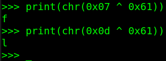
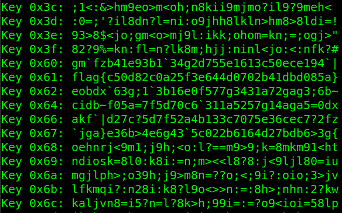

# Zero Ex Six One


Category: Warmup - Rev

Difficulty: very easy


## Description

> **Author**: @HuskyHacks\
> I'm XORta out of ideas for how to get the flag. Does this look like anything to you?\
> **Attachments:** _flag.txt.encry_

## Solve Walkthrough

* Here's the _flag.txt.encry_ content file.


```txt
0x070x0d0x000x060x1a0x020x540x510x050x590x530x020x510x000x530x540x070x520x040x570x550x550x050x510x560x510x530x030x550x500x050x030x050x510x590x540x000x1c
```


* First of all, I ask to GPT, what the heck is this encrypted flag is (coz I'm beginner in RE and crypto stuffs).
* Basically, GPT said that **the flag possibly encrypted with XOR cipher**.
* Here's the solver script generated from GPT.


```python
#!/usr/bin/env python3

data = bytes([
    0x07, 0x0d, 0x00, 0x06, 0x1a, 0x02, 0x54, 0x51, 0x05, 0x59,
    0x53, 0x02, 0x51, 0x00, 0x53, 0x54, 0x07, 0x52, 0x04, 0x57,
    0x55, 0x55, 0x05, 0x51, 0x56, 0x51, 0x53, 0x03, 0x55, 0x50,
    0x05, 0x03, 0x05, 0x51, 0x59, 0x54, 0x00, 0x1c
])
print(f"Data: {data}\nLength of data: {len(data)}")

for key in range(0x20, 0x7F):
    decoded = ''.join(chr(b ^ key) for b in data)
    # Check for printable ASCII value.
    if all(32 <= ord(c) <= 126 or c == '\n' for c in decoded):
        print(f"Key {hex(key)}: {decoded}")
```


* So, we've to put the sequence of bytes into a list of bytes (_data_).
* Loop from `0x20` until `0x7E`, which is all printable ASCII characters in human readable text, such as _letters_, _numbers_, and _symbols_. The `0x7F` hex value is commonly use for obfuscate the text (`DEL`). Go to this website to see all list of ASCII tables: "[https://byte-tools.com/en/ascii](https://byte-tools.com/en/ascii)[/](https://byte-tools.com/en/ascii)".
* Like the name of this challenge, the printable characters is start from XOR-ing the bytes of data with `0x61` (a).
* `0x07` ^ `0x61` = **f** ; `0x0d` ^ `0x61` = **l** -> can you see the flag pattern ?

<figure><figcaption></figcaption></figure>

* The if statement inside the for loop is to filtered only readable **decoded text**, which is excluding weird characters such as `\x00`, `\xFF`, etc.
* After we run the solver script, the output is like this:

<figure><figcaption></figcaption></figure>

* Notice in key `0x61` , we got the flag.

## Flag

<kbd>flag{c50d82c0a25f3e644d0702b41dbd085a}</kbd>
